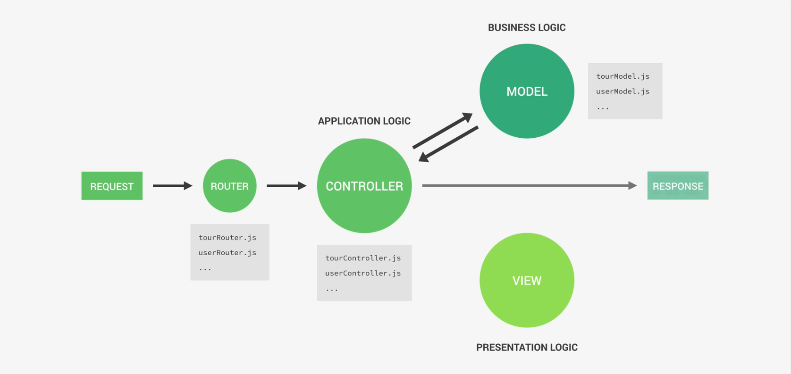

# What is MVC?
========================================================

* MVC means = Model-View-Controller
* The Model-View-Controller (MVC) is an `architectural pattern` that separates an application into `three main logical components`: the model, the view, and the controller.

 
 

I'm describing the picture here:  

🤠 In MVC structure, I have to make `seperate component` for <ins>**Controller**</ins>, <ins>**Model**</ins> and <ins>**Logic**</ins>.  
🤠 Like I have to create different javascript `.js` files for each component.
🤠 For example: I need to create 
 * `tourRouter.js` and `userRouter.js` for handling all the Routing work. 
 * `tourController.js` , `userController.js` for handling all the `application LOGIC` in the **controller**.
 * `tourModel`, `userModel.js` for handling all the `Business LOGIC` in the **Model**. 

 
 
🤠 When a user makes a request, the request goes to the one of the `router.` Remember, in application I'll have multiple router. One for each category
🤠 The `router` sends the data to the `Controller` and it handles the application logic.
 
  

 

 
  
  
 
🤠 One of the goal of MVC is to seperate Business Logic and Application Logic.  
 
 #### Application Logic:
 ++++++++++++++++++++++++++++++++
 
🤠 **Application Logic** is concerned about `managing request` and `responses`. It's more about application's technical aspects.  
🤠 **Application Logic** is the Bridge between `model` and `view` layers.

 

#### Business Logic:
++++++++++++++++++++++++++++++++

🤠 Code that actually solves business Problems.
🤠 Directly related business rules, how the business works and business needs.
🤠 Some Examples are:
* Creating new tours in database
* Checking if user's password is correct
* Validating user input data
* Ensuring the user's who only bought the product can only review it.

 

<ins>Remember that, business logic and application logic are almost impossible to seperate completely.</ins>

 

Which means they sometimes will take both sides.

